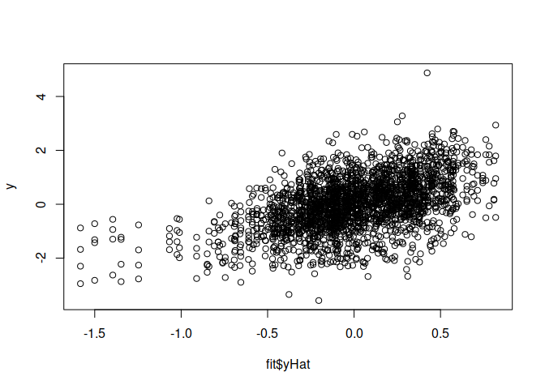

<p align="center">

<a href="https://github.com/italo-granato/BGGE">

</a>

<h4 align="center">

Bayesian Genomic Linear Models Applied to GE Genome Selection -
Development version 0.6.5

</h4>

<h4 align="center">

\[Last README update: 2018-11-13\]

</h4>

<p align="center">

<a href="https://www.tidyverse.org/lifecycle/#maturing">

</a> <a href="https://www.gnu.org/licenses/lgpl-3.0">

</a> <a href="http://www.repostatus.org/#active">

</a> <a href="">

</a> <a href="https://cran.r-project.org/package=BGGE">
 </a>

</p>

</p>

# Table of contents

  - [NEWS](#news)
  - [Instructions](#instructions)
      - [Installation](#install)
      - [Load the package](#package)
      - [Quick use](#example1)
      - [Other Params](#params)
  - [How to cite this package](#cite)
  - [Contributions](#contributions)
  - [Authors](#authors)

<h2 id="news">

News of this version (0.6.5)

</h2>

Changes:

  - Added compatibility with the functions (print() and plot()).
  - Include ORCID of the authors.
  - Include url of the project.
  - Now the `BGGE()` function exports the input parameters.

See the last updates in [NEWS](NEWS.md).

<h2 id="instructions">

Instructions for proper implementation

</h2>

<h3 id="install">

Installation

</h3>

To complete installation of dev version of BGGE from GitHub, you must
have previously installed the devtools package.

``` r
install.packages('devtools')
devtools::install_github('italo/BGGE')
```

If you want to use the stable version of BGGE package, install it from
CRAN.

``` r
install.packages('BGGE')
```

<h3 id="package">

Load the package

</h3>

``` r
library(BGGE)
```

<h3 id="example1">

Example of simple usage of the package

</h3>

``` r
library(BGGE)
library(BGLR)
data(wheat)

X <- scale(wheat.X, scale = TRUE, center = TRUE)
rownames(X) <- 1:599
pheno_geno <- data.frame(env = gl(n = 4, k = 599), 
                         GID = gl(n=599, k=1, length = 599*4),
                         value = as.vector(wheat.Y))

# Creating kernel for GE model

K <- getK(Y = pheno_geno, X = X, kernel = "GB", model = "MM")
y <- as.vector(wheat.Y)

fit <- BGGE(y = y, K = K, ne = rep(599, 4))
fit
```

    ## Model Fitted with: 
    ##  1000  Iterations, burning the first  200  and thining every  3 
    ## 
    ##  Some predicted Values: 
    ##  [1]  -0.2737  -0.4081  -0.3799   0.3694  -0.0362   0.2354   0.2840
    ##  [8]  -0.1194  -0.7742  -1.0280
    ## 
    ##  Use str() function to found more datailed information.

``` r
plot(fit)
```

<!-- -->

<h3 id="params">

Others
params

</h3>

| params  | Use                                                                   |
| ------- | --------------------------------------------------------------------- |
| XF      | Design matrix for fixed effects.                                      |
| ite     | Number of iterations.                                                 |
| ne      | Number of subjects by environment.                                    |
| burn    | Number of iterations to be discarded as burn-in.                      |
| thin    | Thinin interval.                                                      |
| verbose | Should report be printed on screen?                                   |
| tol     | tolerance for zero. Default is 1e-10                                  |
| R2      | the proportion of variance expected to be explained by the regression |

<h2 id="cite">

Citation

</h2>

First option, by the paper.

``` tex
@article {Granato2018,
    author = {Granato, Italo and Cuevas, Jaime and Luna-V{\'a}zquez, Francisco J. and Crossa, Jos{\'e} and Montesinos-L{\'o}pez, Osval A. and Burgue{\~n}o, Juan and Fritsche-Neto, Roberto},
    title = {BGGE: A New Package for Genomic-Enabled Prediction Incorporating Genotype {\texttimes} Environment Interaction Models},
    year = {2018},
    doi = {10.1534/g3.118.200435},
    publisher = {G3: Genes, Genomes, Genetics},
    URL = {http://www.g3journal.org/content/early/2018/07/25/g3.118.200435},
    eprint = {http://www.g3journal.org/content/early/2018/07/25/g3.118.200435.full.pdf},
    journal = {G3: Genes, Genomes, Genetics}
}
```

Second option, by the package

``` r
citation('BGGE')
```

    ## 
    ## To cite package 'BGGE' in publications use:
    ## 
    ##   Italo Granato, Luna-Vázquez Francisco J. and Cuevas Jaime
    ##   (2018). BGGE: Bayesian Genomic Linear Models Applied to GE
    ##   Genome Selection. R package version 0.6.5.
    ##   https://github.com/italo-granato/BGGE
    ## 
    ## A BibTeX entry for LaTeX users is
    ## 
    ##   @Manual{,
    ##     title = {BGGE: Bayesian Genomic Linear Models Applied to GE Genome Selection},
    ##     author = {Italo Granato and Luna-Vázquez {Francisco J.} and Cuevas Jaime},
    ##     year = {2018},
    ##     note = {R package version 0.6.5},
    ##     url = {https://github.com/italo-granato/BGGE},
    ##   }

<h2 id="contributions">

Contributions

</h2>

If you have any suggestions or feedback, I would love to hear about it.
Feel free to report new issues in [this
link](https://github.com/italo/BGGE/issues/new), also if you want to
request a feature/report a bug, or make a pull request if you can
contribute.

<h2 id="contributions">

Research and implementations

</h2>

  - [BGGE: A New Package for Genomic-Enabled Prediction Incorporating
    Genotype × Environment Interaction
    Models](https://doi.org/10.1534/g3.118.200435)

<h2 id="authors">

Authors

</h2>

  - Italo Granato (Author, Maintainer)
  - Jaime D. Cuevas D. (Author)
  - Francisco J. Luna-Vázquez (Author, Maintainer)
